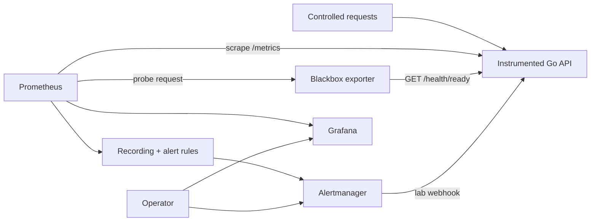

# Homelab SRE Observability

[](https://github.com/vi-nayKR/homelab-sre-observability/actions/workflows/ci.yml)

A reproducible reliability lab that answers four operator questions:

1. Are users succeeding?
2. How quickly is the error budget being consumed?
3. Does an alert describe an actionable symptom?
4. Can another operator follow a runbook and verify recovery?

This is an SRE portfolio project, not a screenshot collection. The repository contains an instrumented Go service, version-controlled Prometheus/Grafana/Alertmanager configuration, black-box probes, rule tests, failure injection, runbooks and an evidence standard.

## What is implemented

- Go 1.27 HTTP service with request count, error class, duration histogram, in-flight gauge and bounded metric labels.
- Distinct `/health/live` and `/health/ready` behavior.
- Safe local-only failure controls for injected 503 responses, latency and readiness failure.
- Prometheus 3.14 with 15-day/4 GB retention ceilings.
- Grafana 13.2 with provisioned datasource and SRE overview dashboard.
- Alertmanager 0.34 with grouping, inhibition and resolved notifications.
- Blackbox exporter 0.28 for user-path availability and latency.
- 99.5% **starter objective** with fast/slow multi-window burn-rate alerts. It is a target, not an availability claim.
- Checksum-aware backup freshness metrics for Node Exporter's textfile collector.
- Go, shell, YAML, dashboard, Prometheus rule and Alertmanager configuration validation.
- Exact multi-architecture image digests as inspected on 2026-08-24.

## Architecture



See [docs/ARCHITECTURE.md](docs/ARCHITECTURE.md) for signal flow and trust boundaries.

## Requirements

- Docker Engine/Desktop with Compose v2
- Go 1.27 for local tests (the container build supplies its own toolchain)
- Bash, `curl`, `jq` and Ruby
- `promtool` and `amtool`, or Docker so validation can use their pinned images

The stack supports ARM64 and AMD64 images. The optional `linux-host` profile is Linux-only.

## Quick start

```bash
make bootstrap
# Edit .env and replace the Grafana password.
make validate
make up
make status
```

Open only from the local machine:

| Component | URL |
| --- | --- |
| Demo API | <http://127.0.0.1:8080/> |
| Demo metrics | <http://127.0.0.1:8080/metrics> |
| Prometheus | <http://127.0.0.1:9090/> |
| Alertmanager | <http://127.0.0.1:9093/> |
| Grafana | <http://127.0.0.1:3000/> |

All published host ports bind to loopback. Do not change them to `0.0.0.0` merely for convenience.

## First game day

Read [docs/GAMEDAY.md](docs/GAMEDAY.md) before starting. The short version is:

```bash
make inject-errors
# Observe request/error/latency signals. The error alert has a five-minute hold.
make stop-errors
```

Readiness failure is separate from liveness:

```bash
make fail-readiness
curl -i http://127.0.0.1:8080/health/ready
curl -i http://127.0.0.1:8080/health/live
make restore-readiness
```

The controls are intentionally unauthenticated because the service binds only to loopback in this lab. They are not a production pattern.

## Adding homelab targets

1. Deploy an exporter through a reviewed change; never expose its port publicly.
2. Restrict the exporter firewall to the monitoring node.
3. Copy an example target file without publishing real LAN addresses.
4. Reload Prometheus only after `promtool check config` passes.
5. Confirm the `up` and black-box series include the expected stable labels.

For a public HTTP endpoint, copy:

```bash
cp configs/prometheus/targets/medha-public.yml.example \
  configs/prometheus/targets/medha-public.yml
```

Then edit the target and labels. Do not commit private targets.

## Validation

```bash
./scripts/validate.sh
```

The script checks:

- `gofmt`, race-enabled Go tests and `go vet`;
- Bash syntax, optional ShellCheck and backup metric behavior;
- every YAML file and dashboard JSON;
- the full Prometheus configuration;
- Prometheus alert/recording rule tests;
- Alertmanager configuration;
- Compose resolution and the demo container build when Docker is available.
- clean-stack startup, service readiness, metric scraping, injected readiness failure, black-box observation and recovery in CI.

The CI workflow requires the container checks. A local environment without Docker may validate source and telemetry rules, but that is not full runtime proof.

## SLO and alert philosophy

The initial availability objective is 99.5% successful black-box probes over 28 days. This intentionally modest lab target must be revised from measured user needs rather than tightened for appearance. Latency is tracked, with a starter objective that 95% of successful `/work` requests complete within 500 ms.

Pages describe user-visible symptoms or imminent loss of recovery capability. Dashboard-only signals help diagnose causes. See [docs/SLO.md](docs/SLO.md).

## Evidence status

Verified on a clean GitHub-hosted AMD64 Linux runner by CI:

- full Compose resolution and demo image build;
- clean-stack startup for the API, Prometheus, Alertmanager, Grafana and blackbox exporter;
- direct health, white-box scrape and black-box success;
- bounded 5xx metric generation;
- readiness failure while liveness remains healthy;
- black-box observation of failure and recovery;
- stack teardown with volumes.

Do not describe the following as complete until artifacts exist under `evidence/`:

- clean-clone runtime on ARM64;
- a firing and resolved alert transcript;
- a dashboard snapshot backed by raw query output;
- an alert-to-recovery game day;
- a completed postmortem corrective action;
- long-window availability or error-budget performance.

## Limitations

- This is a single monitoring stack with no Prometheus/Alertmanager redundancy.
- A laptop that sleeps cannot measure its own absence.
- The default webhook receiver runs in the demo service, so a complete demo outage also breaks that receiver; Alertmanager still retains the alert in its UI. A real page receiver must be out of failure domain.
- Local black-box probes do not prove the view from another region or ISP.
- Fifteen-day retention is shorter than the 28-day SLO window; long-window proof needs longer retention or remote storage.
- No actual availability, MTTR or performance improvement is claimed yet.

See [docs/LIMITATIONS.md](docs/LIMITATIONS.md) and [docs/SECURITY.md](docs/SECURITY.md).
